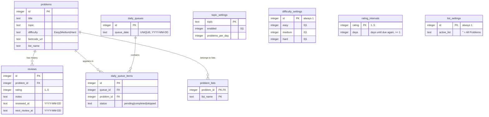

# Cadence

A desktop app for retaining LeetCode and coding interview problems through spaced repetition.
Runs entirely locally — no accounts, no cloud sync.

Built with **Electron + React + SQLite** (`better-sqlite3`).

## Contents

- [Getting started](#getting-started)
  - [Prerequisites](#prerequisites)
  - [Installation](#installation)
  - [Seeding the database](#seeding-the-database)
  - [Running in development](#running-in-development)
  - [Building for production](#building-for-production)
  - [Tests](#tests)
- [Architecture](#architecture)
  - [The three processes](#the-three-processes)
  - [Where everything lives](#where-everything-lives)
- [The database](#the-database)
  - [Tables](#tables)
  - [How they connect](#how-they-connect)
  - [ER diagram (Mermaid)](#er-diagram--mermaid)
  - [ER diagram (DBML)](#er-diagram--dbml)
- [How the daily queue is built](#how-the-daily-queue-is-built)
- [How a review updates the schedule](#how-a-review-updates-the-schedule)
- [Settings & adding problem lists](#settings--adding-problem-lists)
- [Request lifecycle (quick reference)](#request-lifecycle-quick-reference)

---

# Getting started

## Prerequisites

| Tool | Minimum version | Notes |
|---|---|---|
| Node.js | 20.x LTS | v25 is also supported |
| npm | 10.x | Bundled with Node |
| Python | 3.x | Required by `node-gyp` to build `better-sqlite3` |
| Xcode Command Line Tools (macOS) | latest | `xcode-select --install` |
| Visual Studio Build Tools (Windows) | 2019+ | With "Desktop development with C++" workload |

`better-sqlite3` is a native Node module and must be compiled during `npm install`. The tools above satisfy that requirement.

## Installation

```bash
git clone https://github.com/your-username/cadence.git
cd cadence
npm install
```

`npm install` automatically compiles the native SQLite binding. No extra steps are needed after that.

## Seeding the database

Before running the app for the first time, seed the problem lists:

```bash
npm run seed
```

This populates:
- **NeetCode 150** — full problem list
- **Blind 75** — the original curated 75; shares rows with their NeetCode 150
  counterparts (dedup is by title + URL), so it adds a second list membership rather
  than duplicate problems
- **Design Questions** — 25 canonical design problems
- **Topic settings** — sensible defaults (2 problems/day per topic; Dynamic Programming disabled by default)

The seed script is **idempotent** — safe to run multiple times with no duplicates added.

**Database location** — the DB file `interview-repetition.db` lives in Electron's
`userData` directory, **not** in the repo:

| Platform | Path |
|---|---|
| macOS | `~/Library/Application Support/Cadence/interview-repetition.db` |
| Linux | `~/.config/Cadence/interview-repetition.db` |
| Windows | `%APPDATA%\Cadence\interview-repetition.db` |

When running inside Electron, the path is determined by `app.getPath('userData')`. The
CLI seed script recomputes the same path manually (there's no Electron `app` object in a
plain Node run).

## Running in development

```bash
npm run dev
```

This starts two processes concurrently:

1. **Vite dev server** at `http://localhost:5173` — serves the React renderer with hot module replacement
2. **Electron** — waits for the Vite server to be ready, then opens the app window

Hot reload applies to the renderer. Changes to the main process or IPC handlers require restarting `npm run dev`.

## Building for production

```bash
npm run build
```

This produces:
- `dist/renderer/` — bundled React app
- `dist/main/` — compiled Electron main + preload scripts

To package into a distributable:

```bash
npm run package
```

Output is placed in `release/`. Platform-specific artifacts:

| Platform | Output |
|---|---|
| macOS | `release/mac-arm64/Cadence.app` |
| Linux | `release/Cadence-x.y.z.AppImage` |
| Windows | `release/Cadence Setup x.y.z.exe` |

## Tests

Uses Node's built-in test runner via `tsx` (no extra dependencies).

```bash
npm run typecheck   # tsc across the renderer/shared sources
npm test            # pure-logic tests (scheduler interval math) — fast, no native deps
npm run test:db     # eligibility/queue tests that hit SQLite
```

`npm test` covers [`src/main/scheduler.ts`](src/main/scheduler.ts) and runs instantly.

`test:db` exercises `getEligibleProblems` against an in-memory SQLite DB
([`src/db/problems.test.ts`](src/db/problems.test.ts)). Because `better-sqlite3` is a
native module compiled for **Electron's** ABI, this script rebuilds it for plain Node,
runs the tests, then rebuilds it back for Electron. (If a `test:db` run ever leaves the
native module mismatched, `npm run seed` rebuilds it for Electron again.)

---

# Architecture

## The three processes

Electron splits the app into isolated layers that can only talk through a typed
message bridge (IPC). Data never flows directly from the UI to the database.

```
┌─────────────────────────────────────────────────────────────────┐
│  RENDERER  (Chromium + React)            src/renderer, src/screens │
│  - The UI. No Node, no SQLite access.    src/components            │
│  - Calls window.api.queue.getToday() etc.                          │
└───────────────────────────┬───────────────────────────────────────┘
                            │  window.api.*  (typed)
                            ▼
┌─────────────────────────────────────────────────────────────────┐
│  PRELOAD  (bridge)                       src/main/preload.ts       │
│  - contextBridge.exposeInMainWorld('api', …)                       │
│  - Turns each api method into ipcRenderer.invoke('channel', …)     │
└───────────────────────────┬───────────────────────────────────────┘
                            │  ipcRenderer.invoke ↔ ipcMain.handle
                            ▼
┌─────────────────────────────────────────────────────────────────┐
│  MAIN  (Node.js)                         src/main, src/db          │
│  - ipc.ts registers every handler.                                 │
│  - generator.ts + scheduler.ts hold the business logic.            │
│  - src/db/* runs the actual SQL against better-sqlite3.            │
└─────────────────────────────────────────────────────────────────┘
```

The renderer has **no** direct Node or SQLite access — everything goes through IPC:

- [`src/main/preload.ts`](src/main/preload.ts) exposes a typed `window.api` via `contextBridge`.
- [`src/main/ipc.ts`](src/main/ipc.ts) registers an `ipcMain.handle()` for every channel.
- [`src/renderer/api.ts`](src/renderer/api.ts) re-imports the `Api` type from preload, so
  the renderer sees every method and its signature automatically — **end-to-end type safety**.

The single source of truth for the channel contract is the `Api` type inferred from the
`api` object in [`src/main/preload.ts`](src/main/preload.ts) — add a method there and the
renderer sees it automatically. The payload/return shapes it uses (e.g. `ReviewPayload`,
`QueueGroupedByTopic`) live in [`src/types.ts`](src/types.ts).

## Where everything lives

```
src/
  main/                 # Electron MAIN process (Node side)
    main.ts             # App bootstrap, BrowserWindow, dev-vs-prod load
    preload.ts          # contextBridge → typed window.api
    ipc.ts              # ALL ipcMain.handle() handlers, grouped by domain
    generator.ts        # Daily queue generation / refresh / "add more" logic
    scheduler.ts        # Spaced-repetition algorithm (isolated, swappable)
    csv.ts              # CSV (de)serialization for history import/export

  db/                   # SQLite data-access layer (one file per table-ish)
    connection.ts       # Opens + caches the DB, sets pragmas, runs schema init
    schema.ts           # CREATE TABLE statements (the source of truth)
    problems.ts         # Problem queries incl. getEligibleProblems()
    reviews.ts          # Review insert/query, history, reset, CSV import
    queues.ts           # Daily queue + queue-item read/write
    settings.ts         # Topic settings + difficulty settings

  renderer/             # Electron RENDERER process (browser side)
    main.tsx            # React entry point (ReactDOM.render)
    App.tsx             # Root component; in-memory screen routing (no router)
    api.ts              # Re-exports window.api with the Api type
    styles.css          # Global styles

  screens/              # One component per top-nav tab
    QueueScreen.tsx     # "Today" — the daily queue grouped by topic
    HistoryScreen.tsx   # Past reviews; CSV import/export; reset
    ProblemsScreen.tsx  # Browse/search all problems; add to today
    SettingsScreen.tsx  # Per-topic counts + global difficulty toggles

  components/           # Reusable UI pieces
    QueueItem.tsx       # A single problem row in the queue
    ReviewModal.tsx     # Rating (1–5) + notes capture
    AddProblemModal.tsx # Create a brand-new problem
    AddToQueueModal.tsx # Pick an existing problem into today's queue
    ConfirmModal.tsx    # Generic confirm dialog

  seed/                 # One-time data population (run via `npm run seed`)
    neetcode150.ts      # 150 NeetCode problems as NewProblem[]
    design.ts           # 25 system-design questions
    run.ts              # Seed entry point — idempotent

  types.ts              # All shared TypeScript interfaces + IPC contract
```

---

# The database

SQLite via [`better-sqlite3`](https://github.com/WiseLibs/better-sqlite3) (synchronous,
in-process). The schema is defined in one place: [`src/db/schema.ts`](src/db/schema.ts),
run by [`connection.ts`](src/db/connection.ts) with `CREATE TABLE IF NOT EXISTS`, so
opening the DB is enough to guarantee the schema exists. Pragmas set on open:
`journal_mode = WAL` and `foreign_keys = ON`.

There are **9 tables**, in two groups: **content** (what problems exist and what you've
done) and **config** (your settings).

## Tables

### `problems` — the catalog
Every coding problem you could study; one row each. Mostly read-only after seeding.

| Column | Meaning |
|---|---|
| `id` | unique ID (auto-increment) |
| `title` | e.g. "Two Sum" |
| `topic` | e.g. "Arrays", "Graphs" — the grouping key |
| `difficulty` | `Easy` / `Medium` / `Hard` (enforced by a CHECK) |
| `leetcode_url` | link to the problem |
| `list_name` | source list ("NeetCode 150", "Design", …) |

`(title, leetcode_url)` is unique, so the same problem can't be added twice.

### `reviews` — your study log (append-only)
Every time you grade a problem, **one new row is added**. Nothing is updated or deleted
(except a full reset). If you've reviewed "Two Sum" three times there are three rows here,
all pointing at the same problem — the **most recent** one drives scheduling.

| Column | Meaning |
|---|---|
| `id` | unique ID |
| `problem_id` | → `problems.id` (which problem) |
| `rating` | how it went, 1–5 |
| `notes` | free-text notes |
| `reviewed_at` | the day you did it (`YYYY-MM-DD`) |
| `next_review_at` | the day it becomes due again (computed from the rating) |

### `daily_queues` — "a day that has a to-do list"
A marker: one row per calendar day you've generated a queue for.

| Column | Meaning |
|---|---|
| `id` | unique ID |
| `queue_date` | the date, `YYYY-MM-DD` (UNIQUE — one queue per day) |

### `daily_queue_items` — the problems on a given day's list
What you actually see on the **Today** screen.

| Column | Meaning |
|---|---|
| `id` | unique ID |
| `queue_id` | → `daily_queues.id` (which day) |
| `problem_id` | → `problems.id` (which problem) |
| `status` | `pending` / `completed` / `skipped` |

Finishing a problem flips its `status` to `completed` and inserts a `reviews` row.

### `topic_settings` — per-topic preferences
One row per topic, controlling how the daily queue is built.

| Column | Meaning |
|---|---|
| `topic` | topic name (the primary key) |
| `enabled` | 0/1 — include this topic in daily queues? |
| `problems_per_day` | how many problems from this topic to pick each day |

### `difficulty_settings` — one global toggle
A **single row** (always `id = 1`) with three 0/1 flags: `easy`, `medium`, `hard`.
It's a table only because SQLite has no simpler place for one set of toggles.
Defaults: Easy off, Medium on, Hard on.

### `rating_intervals` — user-configurable scheduling intervals
Five rows (one per rating, 1–5) holding how many `days` until a problem is due again
after you grade it. Edited on the Settings screen. The **default** values are *not*
stored in the schema — they're seeded from `DEFAULT_RATING_INTERVALS` in
[`src/main/scheduler.ts`](src/main/scheduler.ts), the single source of truth for
scheduling (see [How a review updates the schedule](#how-a-review-updates-the-schedule)).

| Column | Meaning |
|---|---|
| `rating` | 1–5 (primary key) |
| `days` | days until due again for that rating (≥ 1) |

### `problem_lists` — list membership (many-to-many)
Which lists each problem belongs to. One row per `(problem_id, list_name)`, so a problem
can be in several lists at once (e.g. NeetCode 75 ⊂ 150 ⊂ 250). This is what lets the
overlapping curated lists coexist; the legacy `problems.list_name` column is kept only as
the problem's "origin" for CSV export.

| Column | Meaning |
|---|---|
| `problem_id` | → `problems.id` (part of PK) |
| `list_name` | the list this problem belongs to (part of PK) |

### `list_settings` — the active list
A single row (`id = 1`) holding `active_list` — the list the daily queue draws from.
`''` means **All Problems** (no filter). Edited via the dropdown on the Settings screen.

| Column | Meaning |
|---|---|
| `id` | always 1 (single-row table) |
| `active_list` | selected list name, or `''` for all |

## How they connect

**Real foreign-key links** (`REFERENCES` in the schema):

1. **`reviews.problem_id` → `problems.id`** — a problem has many reviews (its history).
2. **`daily_queue_items.problem_id` → `problems.id`** — a queue item is one problem.
3. **`daily_queue_items.queue_id` → `daily_queues.id`** — items belong to one day.
4. **`problem_lists.problem_id` → `problems.id`** — a problem belongs to many lists.

**Soft links** (matched by value, *not* enforced):

5. **`topic_settings.topic` ↔ `problems.topic`** — matched by the topic string. To keep
   this soft link from silently orphaning problems, `ensureTopicSettingsForAllProblems`
   auto-creates a `topic_settings` row (enabled, 2/day) for every topic found in
   `problems` — on each app launch, during seeding, and whenever a problem is added.
   So new topics are schedulable without any manual setup.
6. **`difficulty_settings`** isn't linked to any row — it's a global filter the generator reads.
7. **`rating_intervals`** isn't linked to any row either — it's pure config the scheduler
   reads when computing a review's next due date.
8. **`list_settings.active_list` ↔ `problem_lists.list_name`** — matched by string; the
   queue only considers problems whose `problem_lists` membership includes the active list.

"Is a problem due?" comes from the **latest** review per problem, compared against
today's date. "Latest" is determined consistently by the **highest `reviews.id`**
(`MAX(reviews.id)`, or `ORDER BY id DESC LIMIT 1`) everywhere in the codebase —
not by `reviewed_at`, because that's date-only and can't break ties between two
reviews on the same day.

## ER diagram — Mermaid

Renders inline on GitHub, or paste into [mermaid.live](https://mermaid.live).



## ER diagram — DBML

Paste into [dbdiagram.io](https://dbdiagram.io).

```dbml
Table problems {
  id integer [pk, increment]
  title text [not null]
  topic text [not null]
  difficulty text [not null, note: "Easy | Medium | Hard"]
  leetcode_url text [not null]
  list_name text [not null]
  Indexes {
    (title, leetcode_url) [unique]
  }
}

Table reviews {
  id integer [pk, increment]
  problem_id integer [not null, ref: > problems.id]
  rating integer [not null, note: "1..5"]
  notes text [not null, default: '']
  reviewed_at text [not null, note: "YYYY-MM-DD"]
  next_review_at text [not null, note: "YYYY-MM-DD"]
}

Table daily_queues {
  id integer [pk, increment]
  queue_date text [not null, unique, note: "YYYY-MM-DD"]
}

Table daily_queue_items {
  id integer [pk, increment]
  queue_id integer [not null, ref: > daily_queues.id]
  problem_id integer [not null, ref: > problems.id]
  status text [not null, default: 'pending', note: "pending | completed | skipped"]
}

Table topic_settings {
  topic text [pk]
  enabled integer [not null, default: 1, note: "0 | 1"]
  problems_per_day integer [not null, default: 2]
}

Table difficulty_settings {
  id integer [pk, note: "always 1 (single-row table)"]
  easy integer [not null, default: 0]
  medium integer [not null, default: 1]
  hard integer [not null, default: 1]
}

Table rating_intervals {
  rating integer [pk, note: "1..5"]
  days integer [not null, note: "days until due again, >= 1 (seeded from scheduler defaults)"]
}

Table problem_lists {
  problem_id integer [ref: > problems.id, note: "part of composite PK"]
  list_name text [note: "part of composite PK"]
}

Table list_settings {
  id integer [pk, note: "always 1 (single-row table)"]
  active_list text [not null, default: '', note: "selected list, '' = All Problems"]
}
```

---

# How the daily queue is built

This is the heart of the app — *"what should I review today?"*. **All of it lives in
[`src/main/generator.ts`](src/main/generator.ts)**, which leans on the SQL in
[`src/db/problems.ts`](src/db/problems.ts) (`getEligibleProblems`) and the date math in
[`src/main/scheduler.ts`](src/main/scheduler.ts).

### Trigger

Opening the **Today** tab calls `window.api.queue.getToday()` → channel `queue:get-today`
→ `getOrGenerateQueue(db, today)`:

- If a `daily_queues` row already exists for today, its items are returned as-is.
- Otherwise a new queue is generated for today.

(`queue:reset-today` deletes today's queue and regenerates; `queue:generate` tops up the existing one.)

### Generation algorithm (`generateQueue`)

1. Read all `topic_settings`, the global `difficulty_settings`, and the **active list**
   (`list_settings.active_list`).
2. Build the **exclude set** = problems already reviewed today (`reviews.reviewed_at = today`)
   ∪ problems already in today's queue. This guarantees no duplicates and no re-showing
   something you just graded.
3. For each topic where `enabled = 1` and `problems_per_day > 0`:
   - Ask `getEligibleProblems(topic, today, enabledDifficulties, excludeIds)`.
   - Take up to `problems_per_day` of them, insert each as a `daily_queue_items` row, and
     add it to the exclude set so later topics can't reuse it.
4. All inserts run inside a single `db.transaction(...)`.
5. Return the items **grouped by topic** for the UI.

### What makes a problem "eligible" (`getEligibleProblems`)

A problem qualifies for a topic's slot when **all** hold:

- `problems.topic` matches the topic, **and**
- its `difficulty` is in the currently enabled set, **and**
- it is **due** — it has no reviews yet, *or* its latest review's `next_review_at <= today`, **and**
- it is not in the exclude set, **and**
- it belongs to the **active list** (`EXISTS` in `problem_lists`) — unless the active list
  is `''` (All Problems), in which case no list filter is applied.

Eligible rows are ordered by `RANDOM()`, so each generation is a fresh shuffle.

> **Switching lists is deferred by design.** The active list is read only here, at
> *generation* time. Today's queue is already persisted in `daily_queue_items`, and
> `getOrGenerateQueue` returns it untouched — so changing the list in Settings affects only
> your **next day** or a **reset-today**, never the queue you're currently working through.

> Implementation detail worth knowing: the "due" check joins each problem to its latest
> review via `reviews.id IN (SELECT MAX(id) GROUP BY problem_id)`. The exclude filter uses
> a `-1` sentinel instead of `NULL` to avoid the SQL `x NOT IN (NULL)` trap (which is
> `UNKNOWN`, not `TRUE`, and would silently drop every row). See the comment in `getEligibleProblems`.

### Refresh / add-more (same file)

- `refreshQueueItem` — swap one queue item for another eligible problem in the same topic
  (delete + insert in a transaction).
- `addMoreForTopic` — append N more eligible problems for a topic; reports how many were
  added and whether the topic is exhausted.

---

# How a review updates the schedule

When you grade a problem in `ReviewModal` (rating 1–5 + notes):

1. Renderer → `window.api.review.submit(payload)` → channel `review:submit`.
2. The handler in [`ipc.ts`](src/main/ipc.ts) reads the configured intervals
   (`getRatingIntervals(db)`) and calls
   `getNextReviewDate(rating, today, intervals)` from [`scheduler.ts`](src/main/scheduler.ts).
3. A new `reviews` row is inserted (`reviewed_at = today`, `next_review_at = computed`).
4. The originating `daily_queue_items` row is marked `completed`.

Because eligibility keys off the **latest** review, that single insert is what pushes the
problem out of the due set until `next_review_at`. That's the entire spaced-repetition loop.

### Scheduling logic — one source of truth: `scheduler.ts`

**All** review-timing logic lives in [`src/main/scheduler.ts`](src/main/scheduler.ts), and
two things are defined there and *nowhere else*:

1. **`DEFAULT_RATING_INTERVALS`** — the canonical default rating → days mapping.
2. **`getNextReviewDate(rating, fromDate, intervals)`** — the only function that computes a
   next-review date.

The mapping is also **user-configurable**: it's stored in the `rating_intervals` DB table
and editable on the **Settings** screen. The split is deliberate —

| Concern | Lives in | What it is |
|---|---|---|
| The default values + the date math | `src/main/scheduler.ts` | **logic** (one source of truth) |
| The *currently configured* values | `rating_intervals` table | **data** |

So the schema never hardcodes interval numbers. On startup (and during `npm run seed`),
`ensureRatingIntervals(db, DEFAULT_RATING_INTERVALS)` does an `INSERT OR IGNORE` to fill any
missing rows from the scheduler's defaults — which means it seeds a fresh DB but never
clobbers values you've customized.

Defaults:

| Rating | Next review in |
|---|---|
| 1 | 1 day |
| 2 | 2 days |
| 3 | 3 days |
| 4 | 5 days |
| 5 | 7 days |

The data flow when intervals are read or changed:

```
Settings screen ⇄ api.settings.getIntervals / updateIntervals
   → channels settings:get-intervals / settings:update-intervals   (src/main/ipc.ts)
   → getRatingIntervals / setRatingIntervals                       (src/db/settings.ts)
   → rating_intervals table

Review submit
   → getRatingIntervals(db)            (load current config)
   → getNextReviewDate(rating, today, intervals)   (src/main/scheduler.ts — the math)
```

To switch to **FSRS**, SM-2, or anything else, replace this one file — nothing else in the
codebase contains scheduling logic. Note the current algorithm is *stateless* (fixed
intervals per rating). A stateful algorithm like FSRS, which tracks per-problem memory state
(ease/stability/difficulty), would additionally need a per-problem state table (e.g.
`problem_state`) — that's the natural next step when FSRS lands, and intentionally **not**
added yet, to keep a single source of truth for "when is this due?" today.

---

# Settings & adding problem lists

- **Topic settings** (`topic_settings`): per-topic `enabled` flag and `problems_per_day`.
  Edited on the Settings screen; consumed by the generator.
- **Difficulty settings** (`difficulty_settings`): a single global row toggling
  Easy/Medium/Hard. Defaults: Easy off, Medium on, Hard on.
- **Review intervals** (`rating_intervals`): the days-until-due per rating, editable on the
  Settings screen. Defaults are seeded from `DEFAULT_RATING_INTERVALS` in
  [`src/main/scheduler.ts`](src/main/scheduler.ts) — see
  [the scheduling section](#scheduling-logic--one-source-of-truth-schedulerts).
- **Active list** (`list_settings.active_list`): a dropdown on the Settings screen picking
  which list the queue draws from (`''` = All Problems). Options come from the distinct
  `problem_lists.list_name` values. Switching it is deferred — see the note under
  [How the daily queue is built](#how-the-daily-queue-is-built).
- **Seeding** (`npm run seed`, [`src/seed/run.ts`](src/seed/run.ts)): idempotently upserts
  the NeetCode 150 + design problems and ensures default topic settings and rating intervals,
  writing to the same DB file the app uses.

### Adding a new problem list

1. Create `src/seed/mylist.ts` exporting `NewProblem[]` (set a distinct `list_name`).
2. Import it in `src/seed/run.ts` and spread it into `allProblems`.
3. Run `npm run seed`. No schema change needed.

**Overlapping lists just work.** Membership lives in `problem_lists`, so the *same* problem
(same `title` + `leetcode_url`) can appear in several list arrays — e.g. a "NeetCode 75"
array that repeats entries already in "NeetCode 150". `upsertProblem` inserts the problem
once but records a `problem_lists` row for **each** list it appears in. So to author 75/250,
you just list the relevant problems under each `list_name`; the overlap is handled
automatically. The new list then shows up in the Settings dropdown.

**New topics register themselves** — you don't have to touch anything else. Any topic
present in `problems` automatically gets a `topic_settings` row (enabled, 2/day) via
`ensureTopicSettingsForAllProblems`, which runs on every app launch and during seeding.
Only edit `DEFAULT_TOPIC_SETTINGS` in `src/seed/run.ts` if you want a *non-default*
per-day count or a topic disabled out of the box (e.g. Graphs 3/day, DP 0/day) — and
those curated values are applied first, so they win over the generic default.

---

# Request lifecycle (quick reference)

```
User clicks "Today"
  → QueueScreen calls api.queue.getToday()           (src/renderer → src/screens)
  → preload maps it to ipcRenderer.invoke('queue:get-today')
  → ipc.ts handler runs getOrGenerateQueue(db, todayIso())
      → reads topic/difficulty settings + active list   (src/db/settings.ts)
      → finds due problems per topic, filtered by list   (src/db/problems.ts)
      → inserts daily_queue_items in a txn      (src/db/queues.ts)
  → returns QueueGroupedByTopic[] back up the same chain
  → QueueScreen renders one section per topic
```
